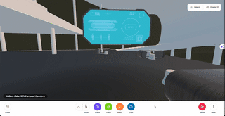
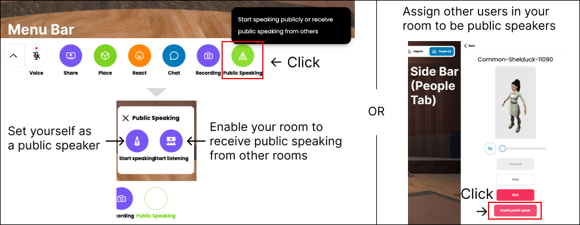

# chutvrc

[](https://opensource.org/licenses/MPL-2.0)

<!-- [](https://travis-ci.org/mozilla/hubs)
[](https://discord.gg/CzAbuGu) -->

The client-side code for chutvrc, forked from [Hubs](https://github.com/Hubs-Foundation/hubs), an online 3D collaboration platform that works for desktop, mobile, and VR platforms.

<div align="center">
    
</div>

## chutvrc features

### Full-body avatars

- Currently, only humanoid avatars made by ReadyPlayerMe or VRoid (with filename extension changed from .vrm to .glb) were confirmed to be compatible to this feature.
- Avatars made with other tool may not behave normally for now, and we will keep trying to improve the implementation to accommodate more kinds of full-body humanoid avatars.
- There may also be problems in Inverse Kinematics(IK) for full-body avatars, especially around wrists. We are planning for improvements.
- Currently tests are mainly done using Meta Quest 3, using controller or bare hand. Hand tracking implementation from other devices are planned for further development.

### BitECS implementation

- Management of avatars to BitECS were implemented independent from Hubs' official BitECS implementation.
- Migration of implementation with the Hubs' BitECS implementation is planned.

### Alternative WebRTC SFU

- Feature for third-party WebRTC SFU solutions for environments hard to host and maintain performance with Dialog (Dialog is set as the default preference)
- chutvrc has implementation of Sora, a proprietary service provided by Shiguredou inc., currently available only for customers in Japan (Check their website for details)

#### How to use Sora

- Please register on your own and fill in the value of your Sora project id and Sora bearer token at the Server Settings in the admin page
- You can also set them in Reticulum's secret file (e.g. `config/dev.secret.exs`) as follows:

  ```
  use Mix.Config

  config :ret, Ret.SoraChannelResolver,
    bearer_token: "YOUR_SORA_CLOUD_BEARER_TOKEN",
    project_id: "YOUR_SORA_CLOUD_PROJECT_ID"
  ```

- If it is enabled at the admin page, Room manager can choose which WebRTC SFU to use for each room at room edit menu.
- At the Server Settings in the admin page, admin can set the default SFU for all newly created rooms and the availability to switching SFU for every room.

### Synchronizing avatar transform with WebRTC DataChannel

- This feature is adapted to both Dialog and Sora.
- With this feature enabled, avatar transforms will be transmitted through DataChannel no matter you are using Dialog or Sora as the SFU.
- It is an experimental implementation considering it is logical to have body language and voice real-time communication transmitted within the same protocol.

### Public speaking: broadcasting audio and avatars across rooms

If you want to deliver speeches to more users beyond the capacity limit of a single room, consider using the public speaking feature.

When a user is designated as a public speaker, their voice and avatar are broadcast to other rooms.

The picture below shows how an admin user can designate themselves or another user as a public speaker, or to enable their room to receive public speaking from other rooms.

<div align="center">
    
</div>

## Instruction for local build

Chutvrc is tested using the following repositories.

- client-side: [chutvrc](https://github.com/pf-hubs/chutvrc-hubs)
- server-side: [chutvrc reticulum](https://github.com/pf-hubs/chutvrc-reticulum)
- WebRTC-side: [chutvrc dialog](https://github.com/pf-hubs/chutvrc-dialog)
- editor-side: [chutvrc spoke](https://github.com/pf-hubs/chutvrc-spoke)

### For Apple Mac (tested with M1 Mac)

Please check [this gist](https://gist.github.com/YHhaoareyou/199410454695d804db5fe7f569d055f0) for local build / development.

### For Ubuntu

Build instruction are planned to be released soon.

Until that, you can refer to [this instruction by albirrkarim](https://github.com/albirrkarim/mozilla-hubs-installation-detailed/blob/main/VPS_FOR_HUBS.md).

## Funding and Sponsor

<div align="center">
    
    
</div>

- chutvrc is sponsored and developed for [CHANGE Project](https://change.kawasaki-net.ne.jp/en/), by a research team at the [Virtual Reality Educational Research Center](https://vr.u-tokyo.ac.jp/), The University of Tokyo.
- You can support this development through the GitHub Sponsor button which is linked to the [UTokyo Foundation](https://utf.u-tokyo.ac.jp/en).
- If you want to support this project only, please write in the donation purpose "For Virtual Reality Educational Research Center, chutvrc related research/educational purpose."
  - Please be aware that 30% of the amount of donation will be used by the university administration office even if you write the donation purpose.

---

Below is the original README for Hubs, which most information are also useful for chutvrc.

It will be updated to migration information considering the current status of Hubs, which is planned to shutdown at the end of May 2024.

---

## Getting Started

If you would like to run Hubs on your own servers, check out [Hubs Community Edition](https://github.com/Hubs-Foundation/hubs-cloud/tree/master/community-edition).

If you would like to deploy a custom client to your existing Hubs Cloud instance please refer to [this guide](https://docs.hubsfoundation.org/hubs-cloud-custom-clients.html).

If you would like to contribute to the main fork of the Hubs client please see the [contributor guide](./CONTRIBUTING.md).

If you just want to check out how Hubs works and make your own modifications continue on to our Quick Start Guide.

### Quick Start

[Install NodeJS](https://nodejs.org) if you haven't already. We use 16.16.0 on our build servers. If you work on multiple javascript projects it may be useful to use something like [NVM](https://github.com/nvm-sh/nvm) to manage multiple versions of node for you.

Run the following commands:

```bash
git clone https://github.com/Hubs-Foundation/hubs.git
cd hubs
# nvm use v16.16.0 # if using NVM
npm ci
npm run dev
```

The backend dev server is configured with CORS to only accept connections from "localhost:8080", so you will need to access it from that host. To do this, you likely want to add "localhost" and "hubs-proxy.local" to the [local "hosts" file](https://phoenixnap.com/kb/how-to-edit-hosts-file-in-windows-mac-or-linux) on your computer:

```
127.0.0.1	localhost
127.0.0.1	hubs-proxy.local
```

Then visit https://localhost:8080 (note: HTTPS is required, you'll need to accept the warning for the self-signed SSL certificate)

> Note: When running the Hubs client locally, you will still connect to the development versions of the [reticulum](https://github.com/Hubs-Foundation/reticulum) server. This server does not allow being accessed outside of localhost. If you want to host your own Hubs servers, please check out [Hubs Community Edition](https://github.com/Hubs-Foundation/hubs-cloud/tree/master/community-edition).

## Contributing

Read our [contributor guide](./CONTRIBUTING.md) to learn how you can submit bug reports, feature requests, and pull requests.

We're also looking for help with localization. The Hubs redesign has a lot of new text and we need help from people like you to translate it. Follow the [localization docs](./src/assets/locales/README.md) to get started.

A Git hook will run before each commit, to lint and test the code.
Fix the issues it complains about, then the hook will allow your commit.
The checks are also run in Continuous Integration, so you'll be requested to fix a Pull Request that fails these checks — the Git hook just gives you faster feedback.
In unusual situations, you can suppress the checks by adding the flag `-n` to your commit command.

To run the checks *before* you commit, run `npm run test`.

Contributors are expected to abide by the project's [Code of Conduct](./CODE_OF_CONDUCT.md) and to be respectful of the project and people working on it.

## Additional Resources

* [Reticulum](https://github.com/Hubs-Foundation/reticulum) - Phoenix-based backend for managing state and presence.
* [Networked A-Frame](https://github.com/Hubs-Foundation/networked-aframe).
* [Hubs-Ops](https://github.com/Hubs-Foundation/hubs-ops) - Infrastructure as code + management tools for running necessary backend services on AWS.

## License

Hubs is licensed with the [Mozilla Public License 2.0](./LICENSE)
